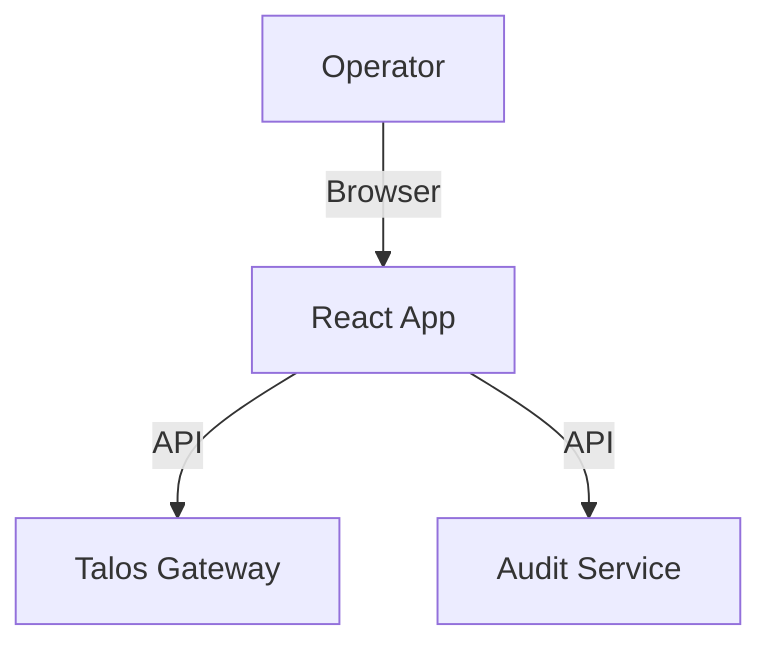

# Talos Security Dashboard

**Repo Role**: Visualization and management UI for the Talos Network state and audit logs.

## Abstract

The Talos Dashboard provides a human-readable interface into the complex state of the autonomous agent network. It visualizes network topology, message flows, and audit logs, allowing operators to monitor system health and compliance.

## Introduction

While Talos is designed for agents, humans need visibility. The Dashboard aggregates data from the Audit Service and Gateway metrics to provide a real-time operational picture.

## System Architecture



## Technical Design

### Modules

- **frontend**: React/Vite application.
- **viz**: D3/Recharts visualizations.

### Data Formats

- **API**: Consumes Gateway and Audit Service APIs.

## Evaluation

Evaluation: N/A for this repo.

## Configuration

The dashboard is configured via environment variables (or `.env.local`):

| Variable            | Default                 | Description                   |
| ------------------- | ----------------------- | ----------------------------- |
| `TALOS_GATEWAY_URL` | `http://localhost:8000` | URL of the main Talos Gateway |
| `TALOS_CHAT_URL`    | `http://localhost:8100` | URL of the Secure Chat Agent  |
| `TALOS_AIOPS_URL`   | `http://localhost:8200` | URL of the DevOps Agent       |

## Usage

### Quickstart

```bash
npm run dev
# Open http://localhost:3000
# You will be redirected to the Login page.

## Authentication

The dashboard is secured with NextAuth v5.

**Default Credentials:**
- **Email:** `admin@talos.security`
- **Password:** `talos_secure_start`

**Configuration:**
Set the following environment variables in `.env.local` to override defaults:
- `ADMIN_EMAIL`
- `ADMIN_PASSWORD`
- `AUTH_SECRET` (Required for production security)


## Operational Interface

- `npm test`: Run frontend tests.
- `scripts/test.sh`: CI entrypoint.

## Security Considerations

- **Threat Model**: Unauthorized access to dashboard.
- **Guarantees**:
  - **Read-Only**: Dashboard is primarily a read-only viewer (depending on config).

## References

1.  [Talos Audit Service](https://github.com/talosprotocol/talos-audit-service)
2.  [Security Dashboard](https://github.com/talosprotocol/talos/wiki/Security-Dashboard)

## License

Licensed under the Apache License 2.0. See [LICENSE](LICENSE).

Licensed under the Apache License 2.0. See [LICENSE](LICENSE).

Licensed under the Apache License 2.0. See [LICENSE](LICENSE).

Licensed under the Apache License 2.0. See [LICENSE](LICENSE).
```
