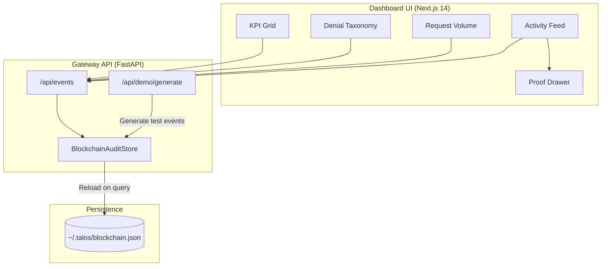
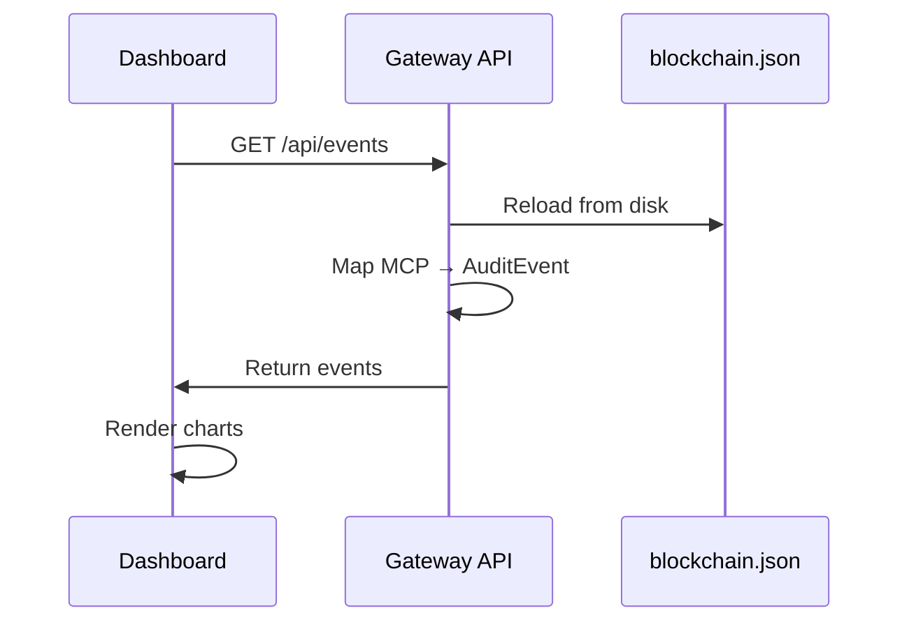

# Talos Security Dashboard

> **Visualization & Control Plane for Talos Protocol v3.2**

[](https://nextjs.org/)
[](https://www.typescriptlang.org/)
[](https://opensource.org/licenses/MIT)

## Abstract

This dashboard provides real-time visibility into the Talos Security Gateway, enabling operators to monitor authorization events, analyze denial patterns, and verify cryptographic proofs. Built with strict contract-driven data validation per the v3.2 Frozen Specification.

---

## Features

| Feature | Description |
|---------|-------------|
| **KPI Grid** | Total Requests, Auth Success Rate, Denial Rate, Latency (p95) |
| **Denial Taxonomy** | Pie chart showing breakdown by denial reason (9 v3.2 reasons) |
| **Request Volume** | Stacked area chart (OK/DENY/ERROR over 24h) |
| **Live Activity Stream** | Real-time audit events with cursor pagination |
| **Proof Drawer** | Click any event to view cryptographic bindings and export evidence |
| **Audit Explorer** | `/audit` page with virtualized table and deep filtering |
| **Blockchain Persistence** | Data survives page reloads via `~/.talos/blockchain.json` |

---

## Architecture



---

## Data Flow



---

## Quick Start

```bash
# Install dependencies
npm install

# Start development server
npm run dev

# Dashboard available at http://localhost:3000
```

### Environment Variables

| Variable | Default | Description |
|----------|---------|-------------|
| `NEXT_PUBLIC_TALOS_DATA_MODE` | `HTTP` | Data source mode (HTTP, MOCK, SQLITE) |
| `NEXT_PUBLIC_API_URL` | `http://localhost:8000` | Gateway API URL |

---

## API Endpoints

The dashboard fetches data from the Gateway API:

| Endpoint | Method | Description |
|----------|--------|-------------|
| `/api/events` | GET | Fetch audit events (paginated) |
| `/api/gateway/status` | GET | Gateway health and version |
| `/api/demo/generate` | POST | Generate demo traffic |

---

## Denial Reasons (v3.2 Frozen)

| Reason | Description |
|--------|-------------|
| `NO_CAPABILITY` | No capability presented |
| `EXPIRED` | Capability expired |
| `REVOKED` | Capability revoked |
| `SCOPE_MISMATCH` | Scope does not cover tool/method |
| `DELEGATION_INVALID` | Delegation chain invalid |
| `UNKNOWN_TOOL` | Tool not registered |
| `REPLAY` | Nonce/correlation reused |
| `SIGNATURE_INVALID` | Cryptographic signature failed |
| `INVALID_FRAME` | Required fields missing or malformed |

---

## Production

```bash
# Build optimized bundle
npm run build

# Start production server
npm start
```

---

## Related Documentation

- [Security Dashboard Wiki](https://github.com/talosprotocol/talos/wiki/Security-Dashboard)
- [Audit Explorer](https://github.com/talosprotocol/talos/wiki/Audit-Explorer)
- [Schemas](https://github.com/talosprotocol/talos/wiki/Schemas)

---

## License

MIT License - See [LICENSE](LICENSE)
