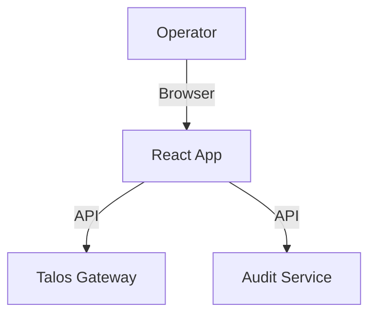

# Talos Security Dashboard

**Repo Role**: Visualization and management UI for the Talos Network state and audit logs.

## Abstract
The Talos Dashboard provides a human-readable interface into the complex state of the autonomous agent network. It visualizes network topology, message flows, and audit logs, allowing operators to monitor system health and compliance.

## Introduction
While Talos is designed for agents, humans need visibility. The Dashboard aggregates data from the Audit Service and Gateway metrics to provide a real-time operational picture.

## System Architecture



## Technical Design
### Modules
- **frontend**: React/Vite application.
- **viz**: D3/Recharts visualizations.

### Data Formats
- **API**: Consumes Gateway and Audit Service APIs.

## Evaluation
Evaluation: N/A for this repo.

## Usage
### Quickstart
```bash
npm run dev
```

## Operational Interface
*   `npm test`: Run frontend tests.
*   `scripts/test.sh`: CI entrypoint.

## Security Considerations
*   **Threat Model**: Unauthorized access to dashboard.
*   **Guarantees**:
    *   **Read-Only**: Dashboard is primarily a read-only viewer (depending on config).

## References
1.  [Talos Audit Service](../talos-audit-service/README.md)
