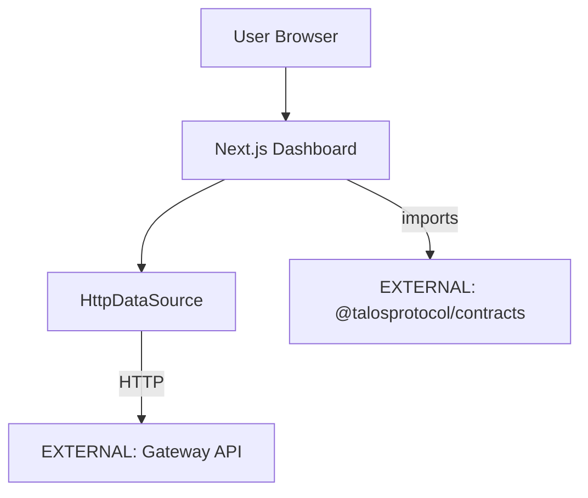

# talos-dashboard Architecture

## Overview
`talos-dashboard` is the Next.js-based Security Console for audit verification, real-time metrics, and proof visualization.

## Internal Components

| Component | Purpose |
|-----------|---------|
| `src/app/` | Next.js App Router pages |
| `src/lib/data/` | Data source abstraction |
| `src/lib/integrity/` | Cursor validation (re-exports) |
| `src/components/` | React UI components |

## External Dependencies

| Dependency | Type | Usage |
|------------|------|-------|
| `[EXTERNAL]` @talosprotocol/contracts | NPM | Cursor derivation, validation |
| `[EXTERNAL]` Gateway API | HTTP | Event fetching, status |

## Contracts Used

| Artifact | Version | Usage |
|----------|---------|-------|
| `deriveCursor` | @talosprotocol/contracts@^1.0 | Cursor validation |
| `decodeCursor` | @talosprotocol/contracts@^1.0 | Cursor parsing |
| `isUuidV7` | @talosprotocol/contracts@^1.0 | Event ID validation |

## Gateway API Integration

| Endpoint | Method | Dashboard Usage |
|----------|--------|-----------------|
| `/api/gateway/status` | GET | Health check polling |
| `/api/events` | GET | Event list fetching |

## Boundary Rules
- ✅ Re-export cursor functions from contracts
- ❌ No `btoa`/`atob` usage
- ❌ No contract logic reimplementation
- ✅ All external calls via DataSource abstraction

## Data Flow

