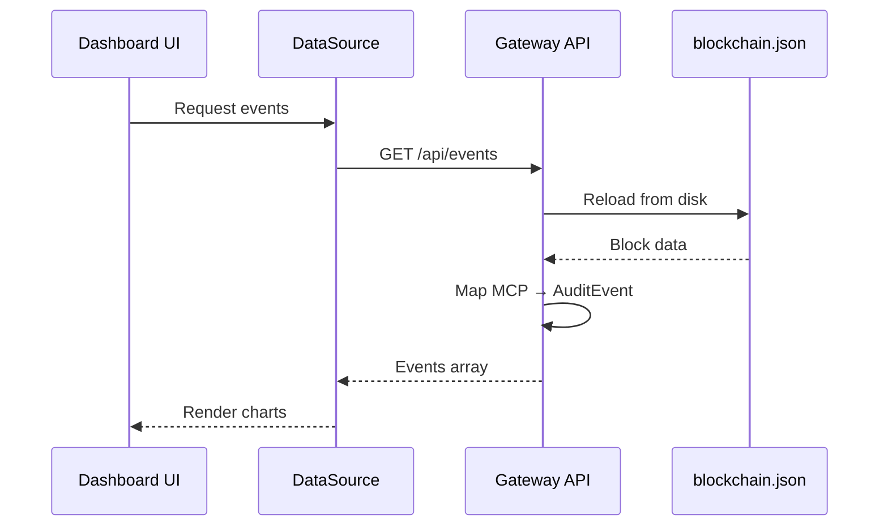
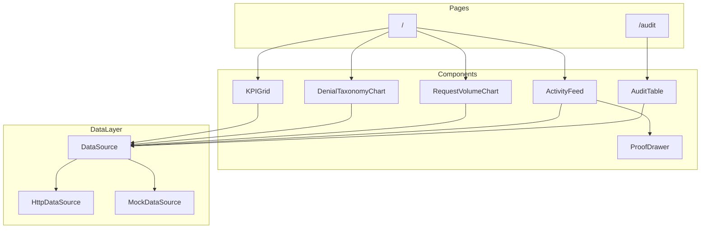

# Architecture

## Overview

The Talos Security Dashboard is a Next.js 14 application that provides real-time visibility into the Talos Security Gateway.

## Data Flow

## Components

## Persistence

Data persists to `~/.talos/blockchain.json`:

1. **External traffic** (TrafficGen, P2P, Connector) writes `mcp_request` events
2. **API Server** reloads blockchain on each query
3. **BlockchainAuditStore** maps raw MCP → AuditEvent format
4. **Dashboard** displays unified event stream

## Technology Stack

| Layer | Technology |
|-------|------------|
| Framework | Next.js 14 (App Router) |
| UI | React 18, Tailwind CSS |
| Charts | Recharts |
| State | React hooks |
| API | FastAPI (separate service) |
