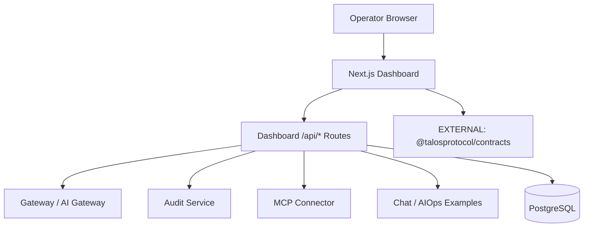

# talos-dashboard Architecture

## Overview
`talos-dashboard` is the Next.js App Router operator console for Talos. It renders the authenticated shell UI, owns WebAuthn bootstrap/login, stores auth/setup state in Postgres, and proxies calls to the rest of the Talos stack through dashboard-owned `/api/*` routes.

## Internal Components

| Component | Purpose |
|-----------|---------|
| `src/app/` | Next.js App Router pages |
| `src/app/api/` | Dashboard-owned auth, setup, proxy, and example routes |
| `src/lib/data/` | Data-source abstraction and HTTP/SSE client logic |
| `src/lib/auth/` | Signed-cookie and WebAuthn helpers |
| `src/db/` | Drizzle schema and Postgres access |
| `src/components/` | React UI components |

## External Dependencies

| Dependency | Type | Usage |
|------------|------|-------|
| `[EXTERNAL]` @talosprotocol/contracts | NPM | Cursor derivation, validation |
| `[EXTERNAL]` Gateway / AI Gateway | HTTP | Status, admin, config, and control-plane proxying |
| `[EXTERNAL]` Audit Service | HTTP/SSE | Event lists and live audit stream |
| `[EXTERNAL]` MCP Connector | HTTP | Resource inventory proxy |
| `[EXTERNAL]` Chat / AIOps examples | HTTP | Example backend proxy routes |
| `[EXTERNAL]` PostgreSQL | TCP | Users, passkeys, sessions, setup-helper state |

## Contracts Used

| Artifact | Version | Usage |
|----------|---------|-------|
| `deriveCursor` | @talosprotocol/contracts@^1.0 | Cursor validation |
| `decodeCursor` | @talosprotocol/contracts@^1.0 | Cursor parsing |
| `isUuidV7` | @talosprotocol/contracts@^1.0 | Event ID validation |

## Major Boundaries

- Browser code talks to dashboard-owned routes under `src/app/api/*`, not directly to backend services.
- Auth is passkey-first and enforced by `src/middleware.ts` plus signed cookie validation.
- The dashboard is stateful: auth and setup-helper flows persist data in Postgres-backed tables.
- The active shell is the `(shell)` route group under `src/app/(shell)`.

## Boundary Rules
- ✅ Re-export cursor functions from contracts
- ❌ No `btoa`/`atob` usage
- ❌ No contract logic reimplementation
- ✅ Browser-facing external calls should stay behind dashboard `/api/*` routes

## Data Flow

